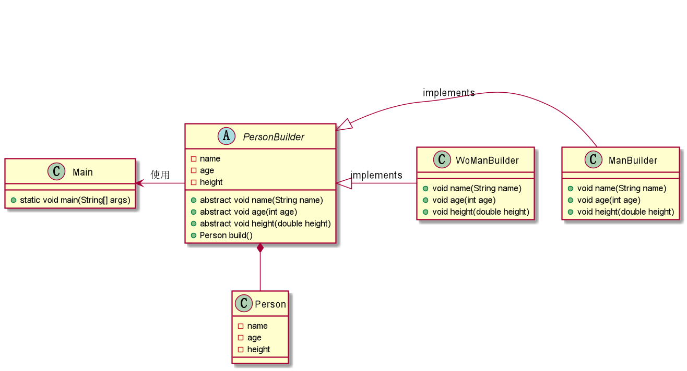

## 建造者模式

- 什么是建造者模式

> 将一个复杂对象的表示和它的构建分离，使得同样的构建过程可以有不同的表示。

我的理解，建造者模式把同一个类的创建过程抽象出来，用来创建不同的对象。例如人类包含
男人，女人，两者的属性（name，age，height）是相同的，只有表现（创建出来的对象）不同。
所以创建不同的性别的对象时，可以通过不同的创建过程来创建不同的表现。

如下图：

- 为什么要使用建造者模式

我的理解是为了复用，同一种class通过不同的builder可以构建不同的object，更能体现出面向对象的思想。

- 如何使用建造者模式

见code包