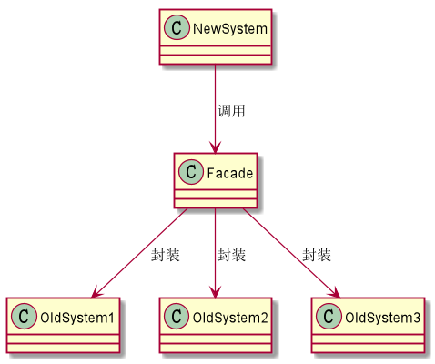

## 外观模式

- 什么是外观模式

外观模式（Facade_pattern）：为子系统中的一组接口提供一个统一的界面，此模式定义了一个高层接口。
使子系统中的功能更加容易使用。

通俗的来说，就是为子系统中繁杂，冗余的接口提供一个更高层的实现，外界需要调用子系统的功能，只需要
调用高层界面的接口即可，无需理解对于内部实现。

- 为什么要使用外观模式

换句话说就是，外观模式的优点是什么？

想象一下，当我们面对很多老旧的，难以维护的系统，此时需求中有些功能需要调用这些旧系统中的
功能，此时我们就可以写一个高层的接口来对旧系统的功能进行封装，之后只需要调用高层中的接口即可，无需
和老旧，难以维护的旧系统做对接。

- 如何使用外观模式

见代码：

- 题外话

外观模式在我看来，其思想上类似于代理模式，不同的是，代理模式作用的是对象层面，而外观模式作用的是系统层面，
其中体现的就是面向对象的“封装”思想。

常见的外观模式：

例如工具类中对Http调用方式的封装，高德地图接口的封装类等等。