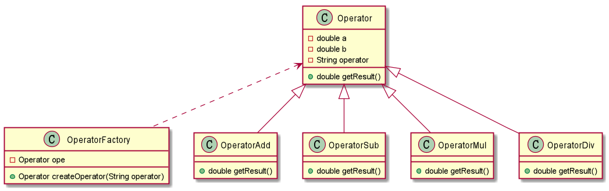
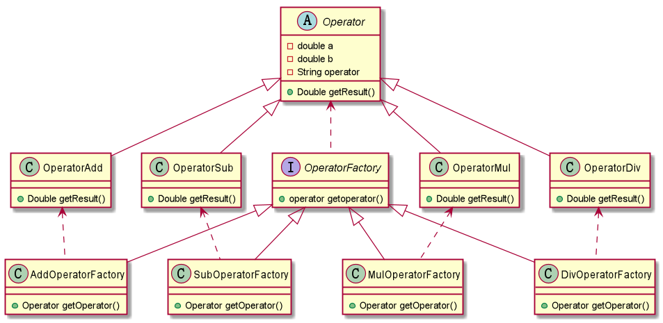

## 工厂方法模式

#### 简单工厂模式

之前在书中看到了简单工厂模式，正好复习一下。简单工厂模式的UML类图如下所示：

简单工厂模式使用到了封装，继承，多态等特性，优点是减少了代码间的耦合度。

不过简单工厂模式有个缺点是：当我新增一个操作类的时候，我要去修改工厂中的
`createOperator()`方法，这样就会增加OperatorFactory出问题的概率，违背了
设计模式中的`封闭-开放`原则。

#### 工厂模式

首先通过UML类图来了解一下工厂模式：

与简单工厂模式相比，工厂模式中的`Factory`不再是一个Class，而是抽象成了一个接口，
具体的对象，由具体的生产工厂来生产。

从图中可以看出，不同的工厂生产不同的操作类，这样如果新增一个操作类的时候，就不用再
去修改Factory中的代码，只需要新增一个Factory实现类即可。

