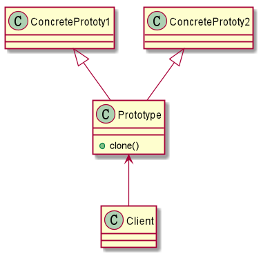

## 原型模式（prototype_pattern）

原型模式是什么？

> 原型模式是指：通过原型对象指定要创建对象的种类，并且通过拷贝原型来
创建新的对象。

通俗解释：就是从一个对象来创建另一个对象，不需要了解其中的创建细节

为什么要使用原型模式？

> 在实际开发中，例如记录流水这一类的实例中，我们需要经常去初始化Record.class
类的对象，这样每次都需要去new一个对象，代码极为冗余且难看，并且相比于原型
模式更加消耗资源。所以通常会初始化一个原型对象，使用该原型对象去创建相同的
对象。

如何使用原型对象？

> 在使用原型模式之前，我们首先要去了解Cloneable接口和Object.clone()对象。

Cloneable接口是一个标记接口，实现此接口的class可以重写Object.clone()方法
来实现实例中属性到属性之间的复制。

如果不实现此接口，就直接调用`clone()`方法，则会抛出`CloneNotSupportedException`
异常。

``protected native Object clone() throws CloneNotSupportedException;`

Object.clone()是一个native修饰的方法。

[关于native修饰符](https://blog.csdn.net/xzknet/article/details/3275861)

- 原型模式的结构图：

从接口图中来看，我们需要首先定义一个抽象类/接口，这个抽象类/接口要有一个clone()

具体流程可看/src/org.apache.myfaces.blank/prototype_pattern/code
