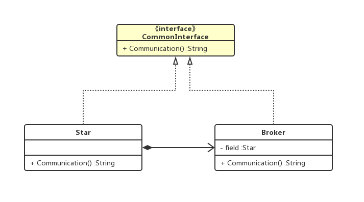
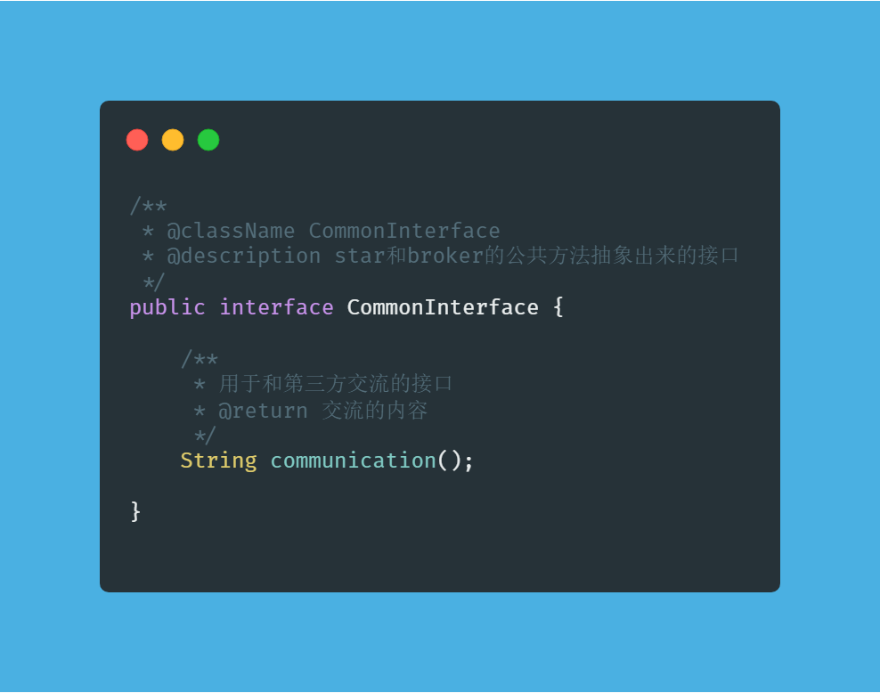
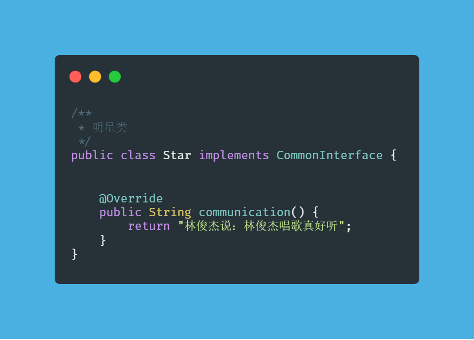
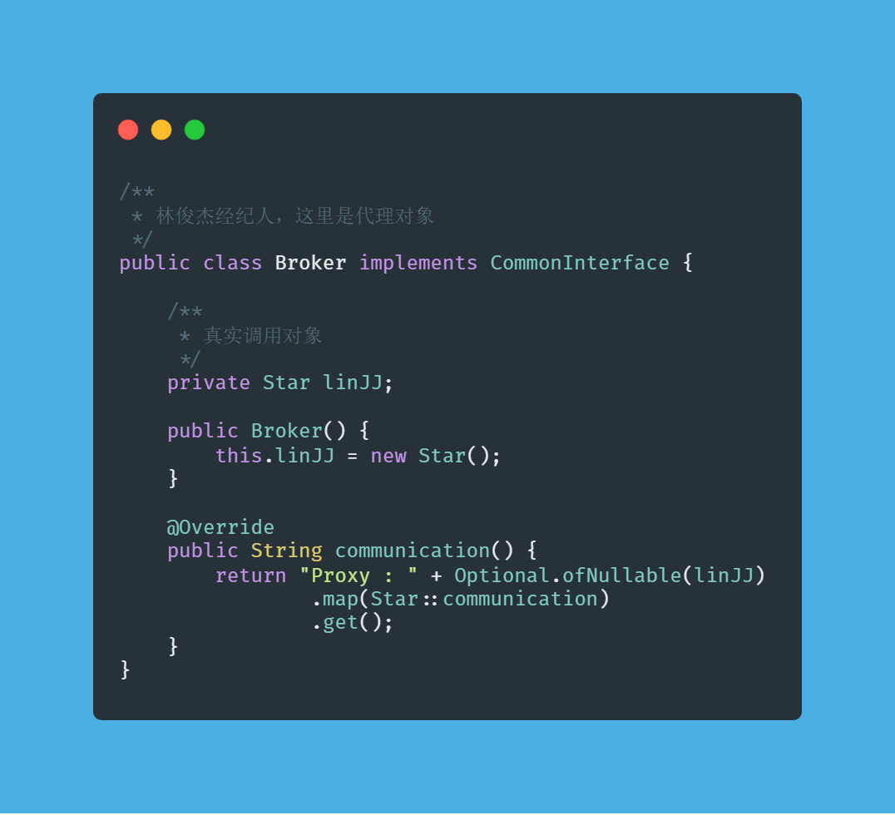
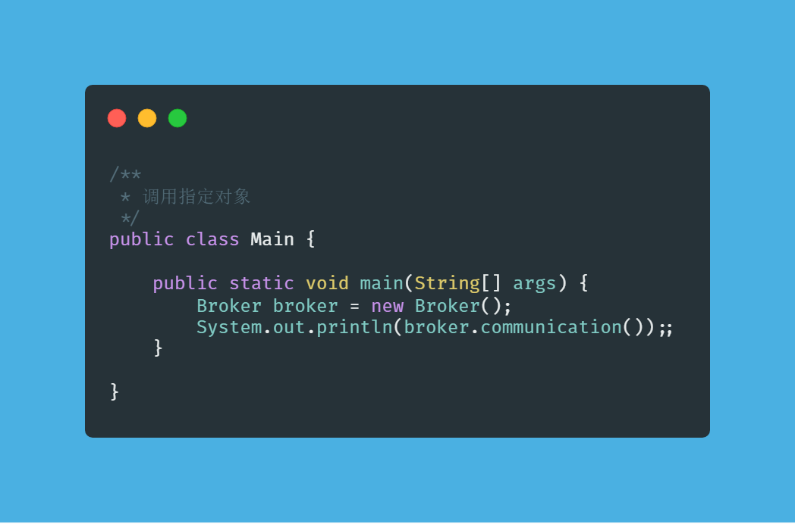

#### 代理模式

什么是代理模式：

> 为其他对象提供一种代理以控制对该对象的访问

#### 举个栗子

很多明星都有经纪人，通常很多活动都是经纪人代替明星在和第三方商议。经纪人对于第三方来说就是
明星的一个代理。

#### 如何使用代理模式

我们用上面的例子来表示代理模式：

比如明星A，在没有经纪人的时候要自己和第三方去沟通。当有了经纪人的时候，就由经纪人去和第三方
沟通。

所以明星(star)和经纪人(broker)，这两个对象都有一个共同的方法，沟通（communication），他们
共同实现了这个方法。所以我们把这个方法抽象出来作为一个接口（CommonInterface）。

UML类图

#### 代码

CommonInterface

Star

Broker

Main

#### 代理模式与装饰者模式的区别

1. 装饰者模式的目的是为了给原有的对象添加新的功能，且不修改原有代码。而代理模式，是为了控制
外部对象对被代理对象的访问控制。

2. 装饰者模式的被装饰对象是由调用方传入的。代理模式的被代理对象则是自己创建的。
