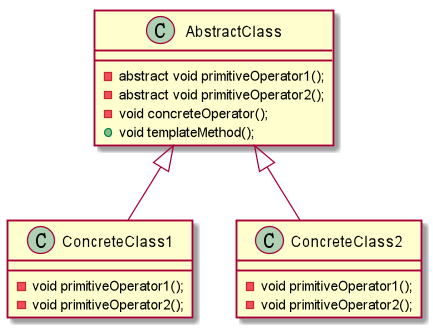

## 模板方法模式

模板方法是什么？

> 模板方法模式：定义一个操作中算法的**骨架**，之后将一些步骤延迟到子类中。
模板方法使得子类可以不改变一个算法的结构即可重新定义算法的某些特定步骤。

为什么要使用模板方法模式？

- 去除冗余代码

> 平常在项目中，最常见的去除冗余代码的方式就是把一个方法抽象出来，然后让其他
的类去调用。当时这样也会造成一种问题：
> 1. 参数问题，参数的命名必须十分规范才可以让人在调用方法的时候去一眼看出这
是一个什么流程的代码，但是在大部分项目中很多人都不会细致的去想这个问题。导致
即使抽象出来，也很少人用。
> 2. 调用混乱，不同模块之间可能有相同的处理流程，如果把它放在一个公共的模块中
就会出现多出调用的问题，维护和修改的时候都会理不清，导致出现问题。

 如何使用模板方法模式？
 
 我们首先来看一个UML类图：
 

在AbstractClass类中，有两个abstract方法，并且有一个已经默认实现的concreteOperator(),
通常在模板方法模式中，concreteOperator()中就是算法的骨架，而abstract修饰的方法，则是要
延迟到子类中实现的方法，之后在templateMethod()中整合三个方法（一起调用）。

具体请查看simple中的代码。

example：

例如有一个试卷需求，需要每个同学输出自己的问题和答案。

第一种最简单的肯定就是根据不同的同学创建不同的学生类，例如：

参考example.simple.solution1下的代码

> 这种代码会有一个缺点，就是两个同学都做得同一份试卷，如果此时要求每道题目中
都新增一个逗号或者问号，数量少了很好改，当Student数量过多时，维护这个试卷
就变成了一个大麻烦。

第二种解决办法：把试卷题目单独抽出来，成为一个试卷类，里面放每道题目的题干。

参考example.simple.solution2下的代码

> 这种解决方式看起来一点问题没有，我们把试卷题目抽取了出来，并且单独维护，这样
如果之后修改题目的话，只需要修改试卷类就可以了。

但是：我们如果仔细查看solution2中的Student*中的代码会发现，两者代码极为相似，除了
两者答案不同，甚至连输出语句都相同。

第三种解决方法，使用模板方法进一步抽象，试卷中本来就会有题目和答案填写处，学生
要做的只是填写答案。例如：

参考example.simple.solution3中的代码。

从第三种解决方式上来说，更贴合现实，并且代码冗余度也更少。

这个模式要真正在项目中使用还是很困难的，还是要多想一想。如果模板方法模式
和工厂模式/策略模式结合起来，相比应该会是一个很好的代码。
 
 